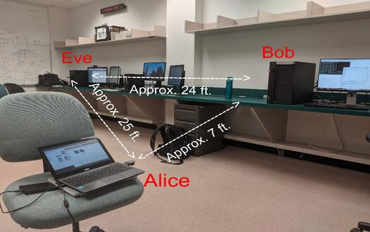
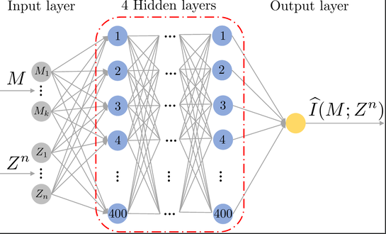
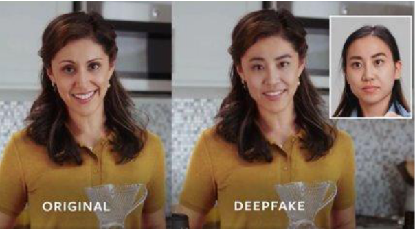
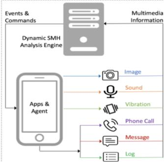
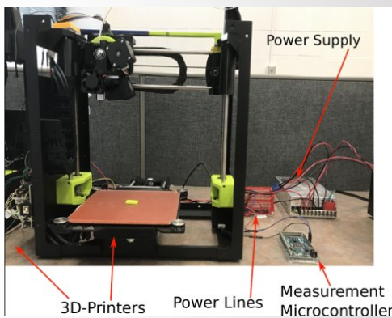
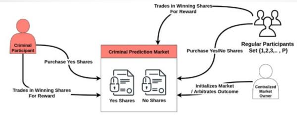
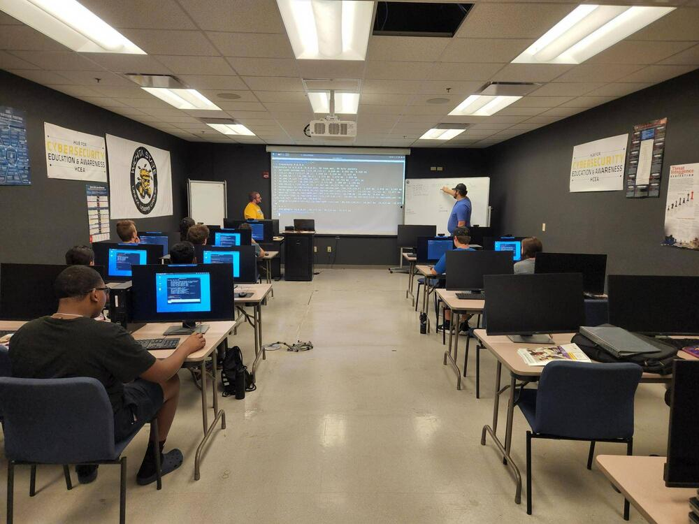

# Research Projects for CyberCorps SFS Students at Wichita State University

Students in the SFS program at Wichita State University are required to complete an approved
cybersecurity project during their scholarship period. Students may choose to participate in a research
project under the guidance of a cybersecurity faculty member. 

The following cybersecurity research labs are currently offering research opportunities for SFS
students. Check them all out to learn what projects are of interest to you. 

[Post-Quantum Information System Security Lab (Prof. Remi Chou)](#post-quantum-information-system-security-lab)

[Visual Computing and Biometrics Security Lab (Prof. Ajita Rattani)](#visual-computing-and-biometrics-security-lab-vcbsl)

[SAIL: Software Analysis & Intelligence Laboratory (Prof. Zhijong Shan)](#software-analysis--intelligence-laboratory-sail)

[CSSL: Cyberphysical System Security Lab (Prof. Salinas Monroy)](#cyberphysical-system-security-lab-cssl)

[Professor Yumi's CJ Lab](#professor-yumi-suzukis-lab)

[HCEA: WSU's Hub for Cybersecurity Education and Awareness (Joe Jabara)](#hub-for-cybersecurity-education-and-awareness)

## Post-Quantum Information System Security Lab
Professor Remi Chou leads the Post-Quantum Information System Security Lab. His research
focuses on post-quantum security and data privacy.  His research aims to build secure and
privacy-preserving communication protocols able to counter cyber threats such as denial of
service attacks, identity thefts, and data privacy breaches.  The results of his research help
secure emerging 6G communication networks, quantum communications networks, distributed data
storage systems, and data management systems.

You can find more information about Professor Chou [here](https://remichou.github.io/).

### Recent Projects Completed by Undergraduate and Master's students at Professor Chou's lab

1. *Deep learning for wireless communication under information-theoretic security guarantees​*
2. *Wireless testbeds for secret-key generation with information-theoretic security guarantees​*
3. *Security for simultaneous wireless information and power transfer in communication networks​*

### Potential Projects for Incoming SFS students at Professor Chou's Lab
Incoming SFS students will have the opportunity to participate in the projects listed below. 

#### Deep learning for distributed data storage​
The ubiquity of networked communication systems in our society raises ever-growing security and
privacy concerns. In particular, such concerns exist for applications that collect private user
information, as in health monitoring, e-commerce, and financial services, and applications
associated with critical infrastructures, such as transportation, smart grids, or process
supervisory management systems. This project aims to explore how deep learning can provide a
learning framework for distributed storage that avoids having a single point of failure and
hence losing private data in its entirety in the case of a security breach.

**Useful skills to have for this project:** Good knowledge of basic probability theory and a
programming language. Experience with Python and Tensorflow for deep learning is highly
desirable.

#### Deep learning for secret-key sharing in wireless networks​
The omnipresence of communication networks and the increasing number of connected users and devices
create challenges related to information security and data privacy. Most designs of current security
solutions are attack-specific and rely on the assumption of computationally limited opponents.
Consequently, systems constantly need to be updated to keep up with the increasing computational power
offered by computers, as well as, always more creative attacks from hackers. A paradigm called
information-theoretic security aims at obtaining security guarantees that hold for any possible strategy
of attack performed by an opponent with unlimited computational power. While several theoretical studies
support this paradigm, the development of practical implementations of information-theoretic secure
methods is still in its infancy. The goal of this project is the implementation of information-theoretic
methods via deep learning for secret-key generation.

**Useful skills to have for this project:** Good knowledge of basic probability theory and a
programming language. Experience with Python and Tensorflow for deep learning is highly
desirable. Knowledge of finite fields would be a plus.  

## Visual Computing and Biometrics Security Lab (VCBSL) 
Professor Ajita Rattani leads the Visual Computing and Biometrics Security Lab (VCBSL). Her research
uses artificial intelligence (AI) to develop methods for biometrics-based person authentication
in security applications. Students in her lab employ several AI methods to design the
authentication systems, including machine learning, deep learning and adversarial pattern
classification.

You can find out more about Professor Rattani's research [here](https://www.wichita.edu/academics/engineering/SoC/research/VCBSL/index.php).

### Recent Projects Completed by Undergraduate and Master's students
1. *Multimodal systems for DeepFake Detection*, 
2. *Impact of unknown spoof attacks on the biometric system*, and 
3. *XceptionNet for Deep fake Detection*. 

### Potential Projects for Incoming SFS students at VCBSL
Incoming SFS students will have the opportunity to participate in the projects listed below. 

#### Multimodal Audio-Visual based Deepfake Detection
Description goes here. 

**Useful skills to have for this project:** List a few skills that students need for this project. This
will help them make a case in their research interest when they talk about the skills they have. 

#### Improving Cross-dataset Generalization of Facial Spoofing Detection
Description goes here.

**Useful skills to have for this project:** List a few skills that students need for this project. This
will help them make a case in their research interest when they talk about the skills they have. 

## Software Analysis & Intelligence Laboratory (SAIL)
Professor Zhiyong (Tim) Shan leads the Software Analysis & Intelligence Laboratory (SAIL). His
research interests are in mobile phone and system security. He
focuses on developing new program analysis methods to detect security vulnerabilities in
Android apps, smart devices, and operating systems. He also uses Natural Language Processing to 
protect users' privacy on Android/Linux/Windows platforms. 

You can find more information about Professor Shan's research [here](https://www.wichita.edu/profiles/academics/engineering/SoC/Shan-Zhiyong.php).

### Recent Projects Completed by Undergraduate and Master's students at SAIL

1. *Automated Dynamic Detection of Self-Hiding Behaviors in Mobile Platforms*
2. *Root-kit detection in Linux kernel​*
4. *Automated Testing to Detect Status Data Loss in Android Applications*

### Potential Projects for Incoming SFS students at SAIL
Incoming SFS students will have the opportunity to participate in the projects listed below. 

#### Automated Dynamic Analysis for Smart Device Malware Hiding Mechanisms
Project description goes here

**Useful skills to have for this project:** List a few skills that students need for this project. This
will help them make a case in their research interest when they talk about the skills they have. 

#### Automated detection of security and privacy issues in mobile applications
Project description goes here

**Useful skills to have for this project:** List a few skills that students need for this project. This
will help them make a case in their research interest when they talk about the skills they have. 

## Cyberphysical System Security Lab (CSSL)
Professor Salinas Monroy leads the Cybperphysical System Security Lab (CSSL). 
His research focuses on developing new methods to secure critical infrastructures including
additive manufacturing, power grids, and edge computing networks. Students in his lab combine
insights about the physical world with data science methods to provided system-specific privacy
and security solutions. 

You can find more information about Professor Salinas Monroy's research [here](https://cssl-wsu.github.io/).

### Recent Projects Completed by Undergraduate and Master's students at CSSL

1. *Convolutional Neural Network Optimization for Phishing Email Classification* ​
2. *Reverse Engineering of an IoT device's firmware used in farming equipment.​*
3. *An energy-based deep learning method for detecting APTs in 3D-printers​*

### Potential Projects for Incoming SFS students at CSSL
Incoming SFS students will have the opportunity to participate in the projects listed below. 

#### Secure resource allocation in edge computing networks​
The use of IoT devices in critical infrastructure is increasing rapidly. IoT devices are
commonly used to monitor and operate real-time physical processes, such as power systems,
manufacturing, and autonomous vehicles. However, due toe their limited computing and energy
storage resources, the amount and complexity of applications they can execute is also limited.
To address this challenge, IoT devices can outsource high-complexity operations to edge
computing servers, which are located relatively close compared to the cloud. By outsourcing
their computations, IoT devices can run complex applications with minimum delay and energy
consumption. Unfortunately, adversaries can sabotage IoT operations by compromising the edge's computing
and communications resources. In this project, students will design deep learning methods to
operate edge networks under adversarial attacks. 

**Useful skills to have for this project:** Experience in at least one
programming language. Basic knowledge of computer networks, and/or basic knowledge of machine
learning/Artificial intelligence. Interest in understanding network optimization methods is highly
desirable.   

#### Detection of Attacks Against Space Situational Awareness Systems using Deep Learning
Satellite operators use space situational awareness (SSA) systems to plan their launches. The SSA
provides information about the orbits of objects already in orbit, including both satellites and debris.
Thus, the integrity of the SSA is crucial to maintain safe space operations. Traditionally, SSAs have
collected information about in-orbit objects through direct observation using radars and telescopes, and
by obtaining launch information from satellite operators. However, as the number of satellite launches
increases rapidly due to reduced launch costs, SSA update their databases using third-party
data collectors. In this project, students will investigate potential attacks that adversaries
can launch against SSAs and design detection techniques using deep learning.  

**Useful skills to have for this project:** Experience in at least one
programming language. Basic knowledge of computer networks and/or knowledge of machine
learning/Artificial intelligence. Interest in understanding how the orbits of satellites are
defined is highly desirable.

#### Detection of malware network traffic using deep neural networks
Malware is controlled by their operators through a command and control (C2) server. To avoid
being easily detected, malware operators host their C2 servers in a stealthy way. They rotate their IP
address, frequently change the domain name, and use non-traditional network protocols to exchange
information with their compromised hosts. Traditional malicious network traffic detection techniques
often rely on access to plaintext information in the packets sent by the C2 server, such as the domain
name in a DNS packets. However, as malware operators encrypt their communications, many
detection methods are rendered obsolete. In this project, students will design and implement
deep-learning based malicious network traffic detection methods. 

**Useful skills to have for this project:** Experience in at least one
programming language. Basic knowledge of computer networks, and/or basic knowledge of machine
learning/Artificial intelligence. Interest in understanding how malware network protocols
operate is highly desirable.

## Professor Yumi Suzuki's Lab
Professor Yumi Suzuki from the School of Criminal Justice focuses on technology in criminal
justice. Her research covers a variety of topics, including ​cyberspace as a place for crime
commission and victimization, particularly cyber fraud and other financial crimes, and the
application of technology to help crime victims (e.g., secure reporting system for DV victims,
regaining privacy for victims of human trafficking). 

You can find more information about Professor Salinas Monroy's research [here](https://www.wichita.edu/profiles/academics/fairmount_college_of_liberal_arts_and_sciences/school_of_criminal_justice/Suzuki-Yumi.php).

### Recent Projects Completed by Undergraduate and Master's students co-advised by Professor Suzuki

1. *Modeling Criminal Prediction Markets Using Smart Contracts*
2. *Performance Evaluation of Deception Files as an Attack Detection Method in Honeypots*

### Potential Projects for Incoming SFS students at CSSL
Incoming SFS students will have the opportunity to participate in the projects listed below. Students
involved in the projects listed below will be co-advised by Prof. Yumi Sizuki and a faculty member in the School of
Computing.  

#### Application of Privacy Enhancing Technologies for Victims of Interpersonal Violence (e.g., domestic violence, cyberbullying)​

Victims of domestic violence are at the highest risk of being seriously injured or killed when
they decide to leave their relationships. With the help of privacy enhancing technologies, they
might be better able to coordinate escape plans, protect their personal information, and
establish a new life. Service providers could also benefit from PETs when they coordinate
services with local organizations so that their clients' data are secure and out of reach for
individuals with a restraining
order. These technologies can be helpful for other types of victims, such as victims of human
trafficking, stalking, and bullying). 

Students will learn the type of PET most appropriate for protecting victims of interpersonal
violence. Students will also propose procedures for implementing PETs in a local organization’s
network.

**Useful skills to have for this project:** 

#### Profiling Ransomware-as-a-Service Creators and Users​ 
Ransomware-as-a-Service (RaaS) is a growing problem for businesses and law enforcement. For
business owners, ransomware incidents can be costly in their operations and data. For law
enforcement, limited resources and undertrained investigators may hinder the prosecution of
most ransomware creators and users. In this project, students will investigate the demographic,
psychological, and other types of profiles that are common across RaaS criminals. 

**Useful skills to have for this project:**

#### Cybersecurity Training for Seniors: Training the Trainers

Seniors have been targets for various scams ranging from tech support to romance. As the FBI’s
annual Internet Crime Report shows, cybercrime incidents and total losses have steadily
increased over the past few years, and seniors have suffered the most monetary losses. 
Students will investigate the types of scams seniors are most vulnerable to, techniques that
scammers use, and payment methods and cash flow. Students will also develop training materials for
seniors to become cybersecurity trainers for other seniors in their communities.  

## Hub for cybersecurity education and awareness
Joe Jabara leads WSU's Hub for cybersecurity education and awareness (HCEA). The hub's mission is to
promote and enhance cybersecurity education and awareness in Kansas through technical
education and outreach. WSU students frequently participate, lead, and develop cybersecurity
training materials for various audiences, including other students, trade groups, small
businesses, and government agencies. Students also lead outreach events to enhance the
security posture of NGOs and municipalities.

You can find more information about the hub's activities [here](https://www.wichita.edu/cyberhub).

### Recent Projects Completed by Undergraduate and Master's students with HCEA

1. *Summer Cybersecurity Bootcamp for High School Students*
2. *Design and delivery of cybersecurity training for visually impaired high school students*

### Potential Projects for Incoming SFS students at CSSL
Incoming SFS students will have the opportunity to participate in the projects listed below. Students
involved in the projects listed below will be co-advised by Joe Jabara and a faculty member from the
School of Computing. 

#### Design and Implementation of a Capture the Flag Competition to raise cybersecurity interest among underrepresented groups. 

The cybersecurity workforce shortage in the US, both in the private and public sector,
jeopardizes the US national security. The lack of enough qualified cybersecurity professionals
leaves critical infrastructures vulnerable to advanced adversaries. Industry and academia have
proposed cybersecurity competitions as an effective way of increasing interest in cybersecurity
careers, and ultimately increase the number of cybersecurity professionals. Although compeitions have
been shown to be successful in encouraging students to pursue careers in cybersecurity, many
available competitions require advanced computer skills, knowledge, and sometimes, equipment. Such
onerous requirements often discourage students who could otherwise be successful
cybersecurity professionals. To tackle this challenge, students in this project will design,
implement, and deliver a Capture the Flag (CTF) competition tailored to increase the interest
in cybersecurity careers in a specific demographic group, such as middle or high school
students, students in rural communities, and/or underrepresented populations in cybersecurity
such as women. 

**Useful skills to have for this project:** Experience in at least one programming language. Basic
knowledge of cybersecurity principle is a plus. Interest in 1) serving disadvantaged students and 2)
learning what motivates students to pursue careers in cybersecurity is highly desirable.  